# 🤖 AGENT-PACK: BỘ CÀI ĐẶT .AGENT (FULL-STACK SDLC AI AGENT KIT)

> **Agent-Pack** là bộ khung cài đặt chuẩn công nghiệp giúp "nâng cấp" bất kỳ dự án phần mềm nào thành một môi trường **Agentic AI Coding** hoàn chỉnh.
> Khi cài đặt bộ `.agent/` vào dự án, các trợ lý AI (**Google Antigravity**, **Claude Code**, **Cursor**, **Windsurf**) sẽ tự động đọc hiểu quy trình, tuân thủ các **Cổng Kiểm Soát Chất Lượng (Quality Gates)**, và thực hiện dự án từ A đến Z (Ý tưởng -> Kiến trúc -> Cài môi trường/packages -> Code TDD -> Bảo mật -> Docker CI/CD).

---

## 📚 TÀI LIỆU HƯỚNG DẪN CHI TIẾT (DOCUMENTATION INDEX)

Toàn bộ tài liệu chi tiết của dự án được tổ chức khoa học trong thư mục [`docs/`](./docs/):

| Tài Liệu | Nội Dung Chính | Liên Kết Trực Tiếp |
| :--- | :--- | :--- |
| **01. Cài Đặt & Khởi Tạo** | Hướng dẫn tải về từ Git, chạy lệnh `agent-pack init`, kiểm tra `doctor` và `status`. | 👉 [docs/01-installation-guide.md](./docs/01-installation-guide.md) |
| **02. Bộ Prompt Chuẩn (Playbook)** | **Tập hợp câu lệnh Prompt mẫu (Copy & Paste)** điều phối AI cho từng Phase từ A đến Z. | 👉 [docs/02-prompt-playbook.md](./docs/02-prompt-playbook.md) |
| **03. Giả Lập Android & TV** | Cách tạo máy ảo Android Mobile & Android TV 1080p, bảng phím remote ADB điều khiển D-Pad. | 👉 [docs/03-emulator-setup-guide.md](./docs/03-emulator-setup-guide.md) |
| **04. Tích Hợp Jira & GitHub** | Cách lấy API Token, cấu hình `.agent/.env.agent` và đồng bộ task 2 chiều. | 👉 [docs/04-jira-github-integration.md](./docs/04-jira-github-integration.md) |
| **05. Danh Mục Kỹ Năng (Catalog)** | Tra cứu chi tiết **9 Kỹ năng Core** và **16 Kỹ năng Stack chuyên sâu** (Web, Mobile, TV, AI, Rust, Java...). | 👉 [docs/05-skills-catalog.md](./docs/05-skills-catalog.md) |

---

## ⚡ BẮT ĐẦU NHANH (QUICKSTART)

Bạn có thể cài đặt và kích hoạt bộ công cụ `.agent` vào dự án theo 2 cách dưới đây:

### Cách 1: Cài đặt tự động qua AI (Khuyên dùng)
1. Mở thư mục dự án của bạn bằng bất kỳ IDE AI nào (**Google Antigravity**, **Cursor**, **Claude Code**, **Windsurf**...).
2. Sao chép (Copy) câu Prompt sau và gửi vào khung chat của AI:

```text
Hãy đọc hướng dẫn từ GitHub repository: https://github.com/Tb3c123/agent-run.git
Thực hiện clone và cài đặt bộ công cụ .agent vào dự án này cho tôi. 
Sau khi cài đặt xong, hãy đọc hiểu file .agent/rules/AGENTS.md, hỏi tôi xem có cần thiết lập cấu hình tích hợp nào không (Jira, GitHub, Figma, Giả lập Android/TV, API keys trong .agent/.env.agent), sau đó kích hoạt kỹ năng 01-core/01-prd-requirements và phỏng vấn tôi từng bước để bắt đầu thực hiện dự án!
```

AI sẽ tự động tải bộ công cụ về, thiết lập các file cấu hình tương thích, khảo sát nhu cầu cấu hình ban đầu và bắt đầu quy trình làm việc chuẩn công nghiệp cùng bạn.

---

### Cách 2: Cài đặt thủ công bằng dòng lệnh Terminal
Nếu muốn tự cài đặt và kiểm soát qua Terminal:

```bash
# 1. Clone repository về máy (chỉ cần làm 1 lần)
git clone https://github.com/Tb3c123/agent-run.git ~/tools/agent

# 2. Cài đặt bộ .agent vào dự án:
# - Nếu muốn thử nghiệm ngay trong thư mục examples:
node ~/tools/agent/bin/agent-pack.js init ./examples

# - Nếu muốn làm dự án hoàn toàn mới (tạo folder riêng):
node ~/tools/agent/bin/agent-pack.js init ./my-new-app
```

Sau khi cài đặt xong, mở dự án trong IDE AI và gửi Prompt bắt đầu:
```text
Bắt đầu dự án: Hãy đọc hiểu file .agent/rules/AGENTS.md. Trước khi lập PRD, hãy kiểm tra và hỏi tôi xem có cần thiết lập cấu hình tích hợp nào không (Jira, GitHub, Figma, Giả lập Android/TV, API keys trong .agent/.env.agent) để chuẩn bị trước cho dự án!
```

---

## 📋 SƠ ĐỒ THỰC THI DỰ ÁN HOÀN CHỈNH (SDLC PIPELINE)

Quy trình tuần tự mà AI bắt buộc phải tuân theo khi nhận diện bộ `.agent/`:

```mermaid
flowchart TD
    Start(["Khởi tạo: Ý tưởng dự án của User"]) --> StepInit["1. Cài đặt bộ .agent/\n(agent-pack init)"]
    StepInit --> AskConfig{"2. AI khảo sát:\nCần thiết lập cấu hình tích hợp không?\n(Jira, GitHub, Figma, Emulators)"}
    AskConfig -- "Có nhu cầu" --> SetupConfig["Điền token vào .agent/.env.agent\nhoặc khởi tạo setup-emulators.sh"]
    AskConfig -- "Bỏ qua / Chưa cần" --> Interview
    SetupConfig --> Interview
    
    subgraph Phase1_PRD ["PHASE 1: Khám Phá & Đặc Tả Nghiệp Vụ (PRD)"]
        Interview["AI phỏng vấn User làm rõ nghiệp vụ\n(User Personas, Core Scope, MVP)"]
        Interview --> GenPRD["Tạo file .agent/memory/PRD.md"]
    end
    
    GenPRD --> QG1{"CỔNG 1 (Quality Gate):\nUser phê duyệt PRD?"}
    QG1 -- "Cần sửa đổi" --> Interview
    QG1 -- "Đã duyệt" --> ArchDesign
    
    subgraph Phase2_Arch ["PHASE 2: Kiến Trúc & Thiết Kế Hợp Đồng Dữ Liệu"]
        ArchDesign["Thiết kế Kiến trúc hệ thống & Lựa chọn Tech Stack\n(Clean Arch / Modular Monolith)"]
        DBDesign["Thiết kế CSDL & ERD Diagram\n(PostgreSQL / MySQL / MongoDB / Hive)"]
        APISpec["Thiết kế hợp đồng API chuẩn Contract-First\n(OpenAPI 3.0 / REST / GraphQL / gRPC)"]
        ArchDesign --> DBDesign --> APISpec
    end
    
    APISpec --> QG2{"CỔNG 2 (Quality Gate):\nUser duyệt Kiến trúc & API Contract?"}
    QG2 -- "Cần chỉnh sửa" --> ArchDesign
    QG2 -- "Đã duyệt" --> AskVenv
    
    subgraph Phase3_Env ["PHASE 3: Khởi Tạo Môi Trường & Cài Đặt Gói Dependencies"]
        AskVenv{"Hỏi User: Bạn có muốn tạo Môi Trường Ảo\n(Python .venv / Node modules / Flutter SDK) không?"}
        CreateVenv["Khởi tạo môi trường cô lập\n(python -m venv .venv, v.v.)"]
        InstallDeps["Cài đặt các gói thư viện cần thiết\n(pip install, npm install, flutter pub get)"]
        VerifyRunner["Kiểm tra Test Runner hoạt động (Smoke Test)\n(pytest, npm test, flutter test)"]
        
        AskVenv -- "User đồng ý" --> CreateVenv --> InstallDeps
        AskVenv -- "Bỏ qua venv" --> InstallDeps
        InstallDeps --> VerifyRunner
    end
    
    VerifyRunner --> BreakTasks
    
    subgraph Phase4_Plan ["PHASE 4: Bóc Tách Task & Đồng Bộ Quản Trị"]
        BreakTasks["Chia nhỏ User Stories thành Tasks cụ thể\n(.agent/memory/tasks.md)"]
        SyncJira{"Có cấu hình Jira / GitHub?"}
        BreakTasks --> SyncJira
        SyncJira -- "Có cấu hình" --> PushJira["Tạo Epic / Story trên Jira Board qua API"]
        SyncJira -- "Không cấu hình" --> StartTDD["Bắt đầu code với Local Tasks"]
        PushJira --> StartTDD
    end
    
    subgraph Phase5_Dev ["PHASE 5: Thực Thi Mã Nguồn Chuyên Sâu (TDD Loop)"]
        StartTDD --> WriteTest["1. Viết Test trước (Unit / Widget / Integration Test)"]
        WriteTest --> WriteCode["2. Viết mã nguồn nghiệp vụ theo Kỹ Năng Stack cụ thể"]
        WriteCode --> RunTest["3. Chạy kiểm thử tự động trong môi trường ảo"]
        RunTest -- "Test Thất bại (Red)" --> FixCode["Sửa lỗi mã nguồn (Refactor)"]
        FixCode --> RunTest
        RunTest -- "Test Vượt qua (Green)" --> MarkDone["Đánh dấu [x] vào tasks.md & Sync Jira"]
    end
    
    MarkDone --> QG3{"CỔNG 3 (Quality Gate):\nToàn bộ Test Suite Pass 100%?"}
    QG3 -- "Chưa đạt" --> WriteTest
    QG3 -- "Đạt" --> AuditCheck
    
    subgraph Phase6_Audit ["PHASE 6: Rà Soát Bảo Mật & Tối Ưu Hiệu Năng"]
        AuditCheck["Rà soát OWASP Top 10, Secrets Leak\nTối ưu N+1 Query, Memory Leaks, Focus Navigation"]
    end
    
    AuditCheck --> DockerBuild
    
    subgraph Phase7_DevOps ["PHASE 7: Đóng Gói Docker & CI/CD Pipeline"]
        DockerBuild["Tạo Dockerfile multi-stage & docker-compose.yml"]
        CICD["Cấu hình GitHub Actions CI/CD / Fastlane"]
        DockerBuild --> CICD
    end
    
    CICD --> QG4{"CỔNG 4 (Quality Gate):\nDocker Build / Test Runner CI Pass?"}
    QG4 -- "Lỗi build/test" --> DockerBuild
    QG4 -- "Thành công" --> FinalRelease["Đóng gói bản dựng (Release) & Cập nhật Jira Done"]
    FinalRelease --> Finish(["DỰ ÁN SẴN SÀNG TRIỂN KHAI PRODUCTION"])
```



---

## 🎯 DỰ ÁN THỬ NGHIỆM MẪU (DEMO PROJECT)

Dự án có sẵn thư mục ví dụ thực hành trực tiếp để bạn làm quen:
- 📁 Thư mục & Hướng dẫn thực hành: [`examples/README.md`](./examples/README.md)
