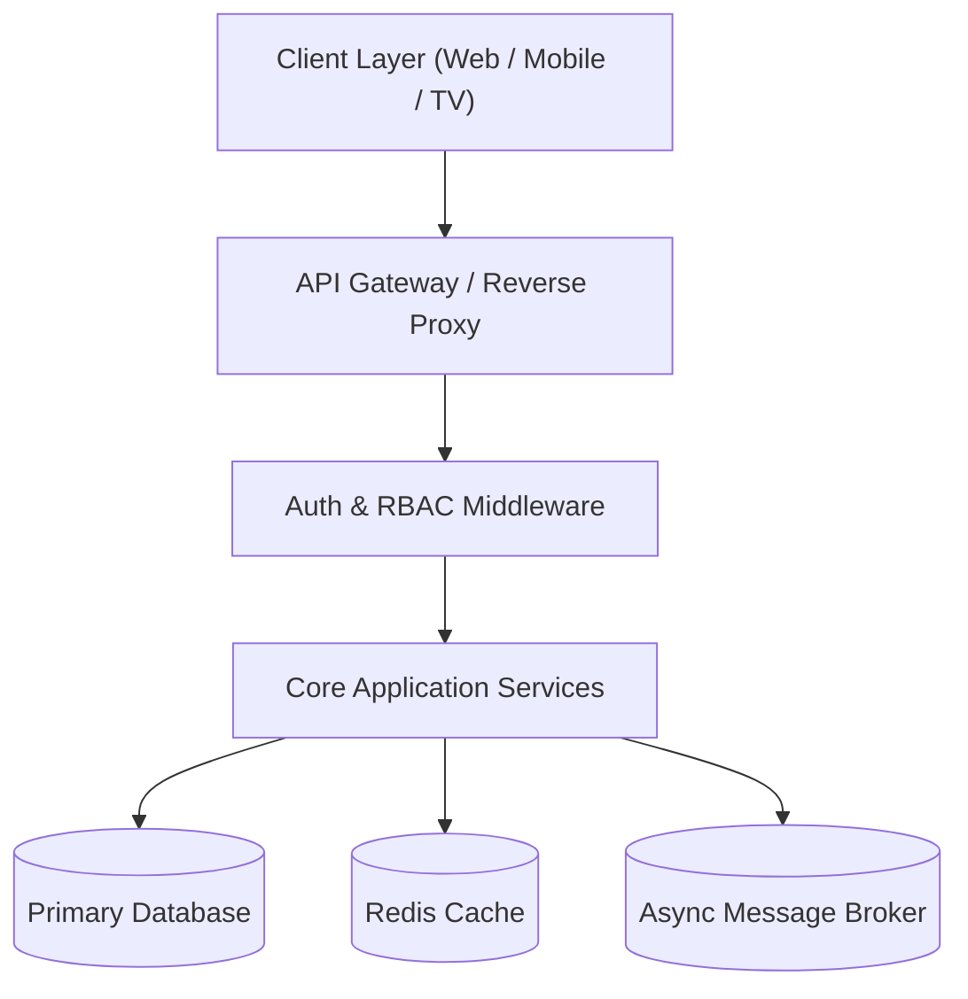

# System Architecture Document

## 1. High-Level Architecture Overview

## 2. Component Boundaries & Responsibilities
- **Presentation Layer**: UI Components, State Management, ViewModels.
- **Application Layer**: Use Cases, Business Logic Orchestration, DTOs.
- **Domain Layer**: Core Business Entities, Invariants, Repository Interfaces.
- **Infrastructure Layer**: Database Implementations, External API Clients, File Storage.

## 3. Technology Matrix
- **Runtime**:
- **Framework**:
- **Database**:
- **Cache / Messaging**:
- **Testing**:
- **CI/CD & Container**: Docker + GitHub Actions.

## 4. Key Non-Functional Strategies
- **Caching Strategy**: Cache-aside with TTL.
- **Rate Limiting**: Token bucket per IP / user token.
- **Resilience**: Circuit breakers, exponential backoff with jitter on external calls.
