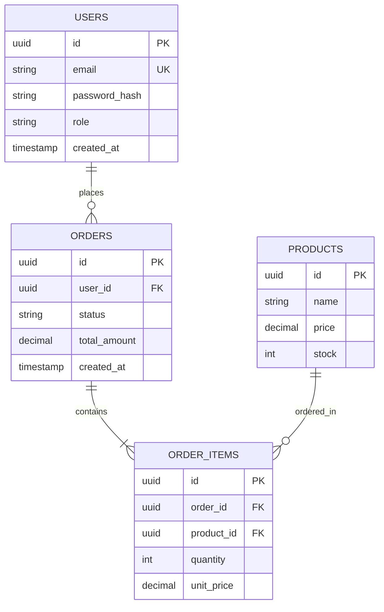

# Database Schema & ERD Specification

## 1. Entity Relationship Diagram (ERD)

## 2. Table Specifications & Indexes

### Table: `users`
- `id`: UUID (Primary Key, default `gen_random_uuid()`)
- `email`: VARCHAR(255) UNIQUE NOT NULL
- `password_hash`: VARCHAR(255) NOT NULL
- `created_at`: TIMESTAMPTZ DEFAULT NOW()
- *Indexes*:
  - `idx_users_email` (UNIQUE B-Tree)

### Table: `orders`
- `id`: UUID (Primary Key)
- `user_id`: UUID NOT NULL REFERENCES users(id) ON DELETE CASCADE
- `status`: VARCHAR(50) DEFAULT 'PENDING'
- `total_amount`: NUMERIC(12, 2) NOT NULL
- *Indexes*:
  - `idx_orders_user_id` (B-Tree)
  - `idx_orders_created_at` (B-Tree)

## 3. Migration Plan
- Migration tool: [Prisma / Alembic / Goose / Drift]
- Seed strategy: Initial admin user, test datasets.
