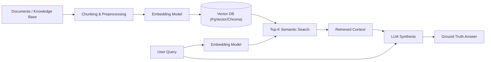

# GenAI & RAG Applications Specialized Stack Skill

## 1. RAG Architecture Pipeline

## 2. Chunking & Indexing Best Practices
- **Chunk Size & Overlap**: Default to 500-1000 tokens with 10-20% overlap (e.g., 800 token chunk with 100 token overlap) to preserve semantic continuity.
- **Metadata Tagging**: Attach `source_id`, `created_at`, `tenant_id`, and `doc_type` to every vector payload for strict multi-tenant filtering.
- **Vector DB Choice**:
  - Prefer `pgvector` extension if PostgreSQL is already in the stack (simplifies infrastructure, ACID compliant).
  - Use Chroma / Qdrant / Pinecone for standalone high-scale vector stores.

## 3. Security & Prompt Injection Guardrails
- Never inject raw user input directly into system prompts.
- Sanitize context and wrap retrieved excerpts in clear delimiters (e.g., `<context>...</context>`).
- Implement an output guardrail validating JSON output against strict schema models before parsing.
